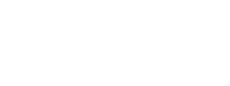

<!--
# SPDX-License-Identifier: AGPL-3.0-or-later
# DockyPody: container build scripts and images
# Copyright (C) 2025 Mahdi Baghbani <mahdi-baghbani@azadehafzar.io>
#
# This program is free software: you can redistribute it and/or modify
# it under the terms of the GNU Affero General Public License as
# published by the Free Software Foundation, either version 3 of the
# License, or (at your option) any later version.
#
# This program is distributed in the hope that it will be useful,
# but WITHOUT ANY WARRANTY; without even the implied warranty of
# MERCHANTABILITY or FITNESS FOR A PARTICULAR PURPOSE.  See the
# GNU Affero General Public License for more details.
#
# You should have received a copy of the GNU Affero General Public License
# along with this program.  If not, see <https://www.gnu.org/licenses/>.
-->

# DockyPody

> Declarative, dependency-aware container builds for the Open Cloud Mesh (OCM)
> image fleet, built on Nushell.

[](https://deepwiki.com/MahdiBaghbani/containers)
[](LICENSE.md)
[](docs/concepts/build-system.md)

DockyPody is a Nushell build system that builds and publishes the container
images behind Open Cloud Mesh (OCM) service stacks. You describe each service,
version, and platform variant in a small set of `.nuon` manifests, and a single
CLI turns them into tagged images and ready-to-run CI workflows. The point is
to make building a whole fleet of OCM images feel routine instead of fragile.

This repository is not the OCM protocol specification. It is the build and
image layer that ships OCM-related stacks such as Nextcloud, CERNBox, oCIS,
OpenCloud, OpenCloudMesh Go, and the supporting services and test tooling
around them.

## Quick start

Prerequisites: Nushell 0.80 or later, GNU Make, OpenSSL, and Docker Engine.

```bash
# Generate shared TLS material (first time only; required for most services)
make tls all

# Build a service
nu scripts/dockypody.nu build --service revad-base
```

For SSH keys, version and platform selection, local development, and full
setup, see the [Getting Started guide](docs/guides/getting-started.md).

## Why DockyPody

Anyone who has kept a wall of Dockerfiles alive knows the tax. There is a
`build.sh` with a hand-tuned order, a stack of near-identical CI matrices, and
the quiet dread of an upstream bump that sends you chasing base-image tags and
cache invalidation for a week. DockyPody exists to make that part boring.

It is aimed at people who build a lot of images at once:

- You describe each service, version, and variant in small `.nuon` manifests,
  so there is no hardcoded build script to babysit.
- The build order comes from a real dependency graph. It understands versions
  and variants, catches cycles, and hands every image the exact tag of the
  parent it was built on, so results are reproducible rather than lucky.
- One definition covers every upstream version and every variant (Debian,
  Alpine, and friends), and the tags are generated for you.
- Cache busting is tied to your upstream source refs, so a cache is only thrown
  away when the sources behind it actually changed.
- The GitHub Actions graph is generated from the same service graph you already
  maintain, so the pipelines cannot quietly drift away from reality.
- While you iterate you can point a service at a local checkout, and CI refuses
  local sources so a work-in-progress path never ships by accident.
- TLS certificates and dev or E2E SSH are handled as part of the build, and
  there is disk monitoring and cache pruning for runners that are tight on
  space.

None of this replaces Docker Buildx, Bake, or Earthly. DockyPody drives Buildx
underneath. Where it earns its keep is a fleet of images that depend on each
other across many versions and variants, when you want the build order,
tagging, cache keys, and CI to come from one place instead of living in
someone's head.

See [Build System](docs/concepts/build-system.md) for the architecture and
build model.

## Services and ecosystem

DockyPody builds the image families used across OCM interoperability work:

- Foundations: `common-tools`, `revad-base`, `nextcloud-base`
- Reva and CERNBox: `cernbox-revad`, `cernbox-web`
- Nextcloud: `nextcloud`, `nextcloud-contacts`, `nextcloud-jupyterhub`
- OCM peers: `opencloud`, `ocis`, `opencloudmesh-go`
- Identity: `idp`
- Browser and E2E: `kasm-base`, `cypress`, `firefox`, `mitmproxy`

Images published from this repository are the defaults used by the
[OCM Test Suite](https://github.com/cs3org/ocm-test-suite) interoperability
harness.

## Documentation

- [Getting Started](docs/guides/getting-started.md)
- [Service Setup](docs/guides/service-setup.md)
- [Build System](docs/concepts/build-system.md)
- [CLI Reference](docs/reference/cli-reference.md)
- [Documentation Index](docs/index.md)

## DeepWiki

For a browsable overview of this repository generated by DeepWiki, see
[DeepWiki](https://deepwiki.com/MahdiBaghbani/containers). The guides and
reference material under [`docs/`](docs/index.md) are still the source of
truth.

## Workflows

CI runs on both GitHub and Forgejo, and the details live in
[CI/CD Workflows](docs/guides/ci-cd.md). GitHub carries the generated full-fleet
build and build-and-push workflows. Forgejo carries lighter validation and a few
extra container builds that are kept by hand. The generated GitHub side always
tracks the live service graph.

## Acknowledgements

DockyPody and these container images exist because some people chose to fund
open source infrastructure. A big thank you to NLnet and the Sovereign Tech
Agency for backing this work, which Mahdi Baghbani develops as part of Open
Cloud Mesh.

<p>
  <a href="https://nlnet.nl/project/OpenCloudMesh/">
    
  </a>
  &nbsp;&nbsp;&nbsp;
  <a href="https://www.sovereign.tech/tech/open-cloud-mesh">
    
  </a>
</p>

You can read the full story in [FUNDING.md](FUNDING.md).

## Contributing

Contributions are welcome. See [CONTRIBUTING.md](CONTRIBUTING.md) for the
workflow, conventions, and validation commands.

## License

Licensed under the GNU Affero General Public License v3.0 or later
(AGPL-3.0-or-later). See [LICENSE.md](LICENSE.md).
