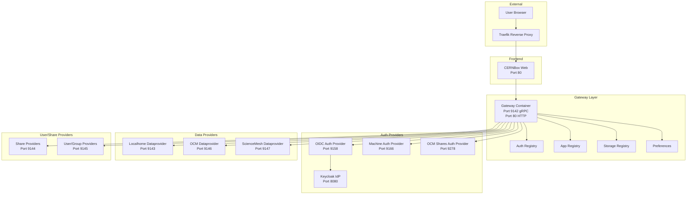
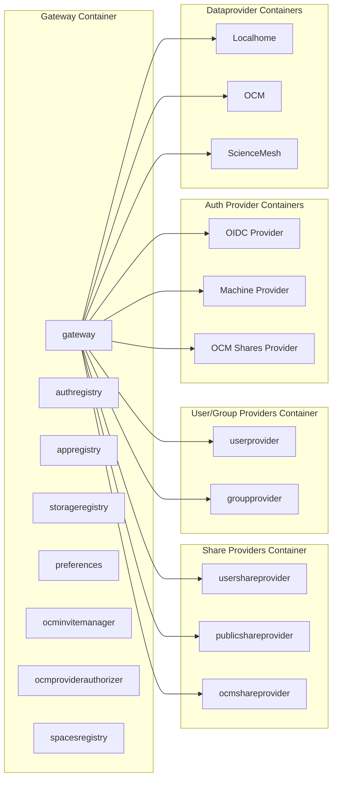
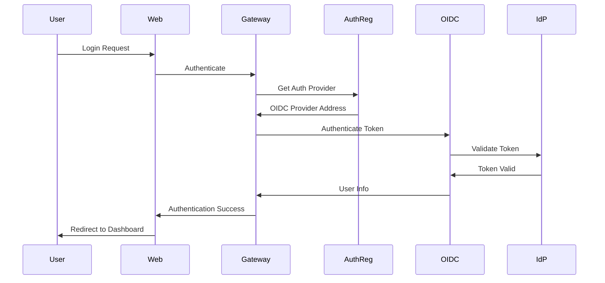
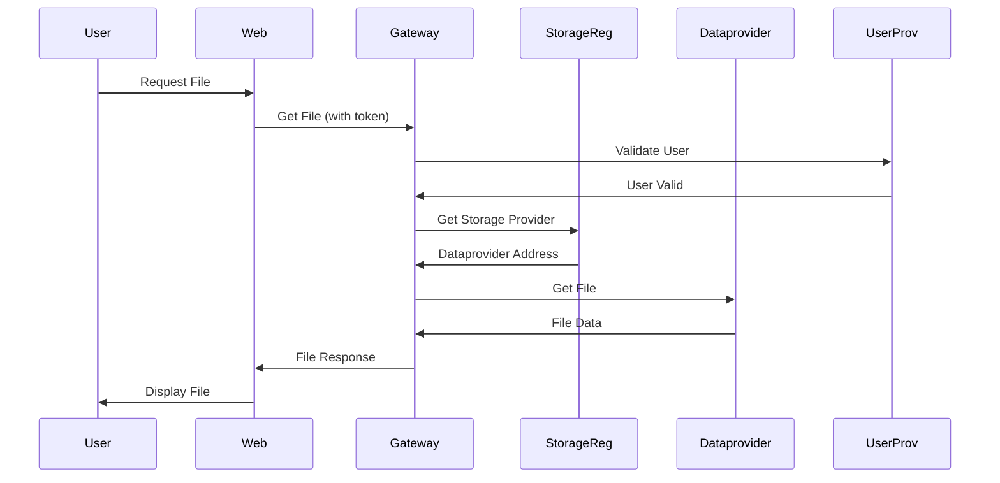

# CERNBox Architecture

This document describes the architecture of the CERNBox multi-container deployment.

## Architecture Overview

CERNBox follows a microservices architecture pattern, with services split across multiple containers for isolation, scalability, and maintainability. The architecture follows the CERN production deployment pattern.

## System Architecture Diagram

## Container Architecture

## Service Communication Flow

### Authentication Flow

### Data Access Flow

## Container Responsibilities

### Gateway Container

- **Services:** gateway, authregistry, appregistry, storageregistry, preferences, ocminvitemanager, ocmproviderauthorizer, spacesregistry
- **Port:** 9142 (gRPC), 80 (HTTP)
- **Role:** Central routing and coordination point
- **Config:** `cernbox-gateway.toml`

### Share Providers Container

- **Services:** usershareprovider, publicshareprovider, ocmshareprovider
- **Port:** 9144 (gRPC)
- **Role:** Manages file and folder sharing
- **Config:** `cernbox-shareproviders.toml`

### User/Group Providers Container

- **Services:** userprovider, groupprovider
- **Port:** 9145 (gRPC)
- **Role:** User and group management
- **Config:** `cernbox-groupuserproviders.toml`

### Auth Provider Containers

- **OIDC Provider:** Port 9158 - OIDC/OAuth2 authentication
- **Machine Provider:** Port 9166 - Machine-to-machine authentication
- **OCM Shares Provider:** Port 9278 - OCM share authentication

### Dataprovider Containers

- **Localhome:** Port 9143 - Local storage provider
- **OCM:** Port 9146 - OCM storage provider
- **ScienceMesh:** Port 9147 - ScienceMesh storage provider

## Service Addressing

The gateway uses explicit addresses for all external services:

- **Template Variables:** Used for same-container services (e.g., `{{ grpc.services.authregistry.address }}`)
- **Placeholders:** Used for external container services (e.g., `{{placeholder:shareproviders.address}}`)

See [Configuration](configuration.md) for details on service addressing.

## Benefits of This Architecture

1. **Isolation:** Service failures don't affect other services
2. **Scalability:** Services can be scaled independently
3. **Maintainability:** Clear separation of concerns
4. **Debugging:** Easier to identify issues in specific services
5. **CERN Compatibility:** Matches CERN production deployment pattern

## Related Documentation

- [Port Assignments](ports.md) - Complete port reference
- [Services](services.md) - Detailed service descriptions
- [Configuration](configuration.md) - Configuration details
