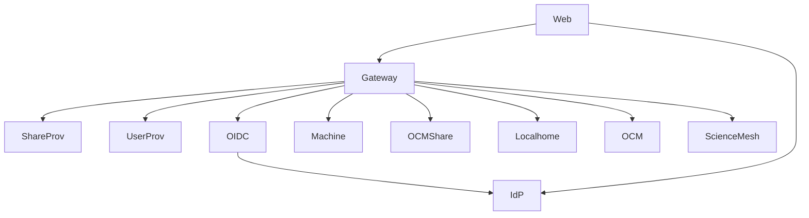

# Services Reference

Detailed description of each service and container in the CERNBox deployment.

## Gateway Container

**Container Name:** `cernbox-1-test-revad-gateway`  
**Port:** 9142 (gRPC), 80 (HTTP)  
**Config File:** `cernbox-gateway.toml`

### Gateway Services

- **gateway** - Main gateway service, routes requests to appropriate providers
- **authregistry** - Maps authentication types to auth providers
- **appregistry** - Manages application registry (MIME types, apps)
- **storageregistry** - Maps storage paths to dataproviders
- **preferences** - User preferences storage
- **ocminvitemanager** - OCM invitation management
- **ocmproviderauthorizer** - OCM provider authorization
- **spacesregistry** - Spaces registry service

### Gateway Responsibilities

- Central routing point for all requests
- Authentication routing via auth registry
- Storage routing via storage registry
- Application registry management
- User preferences management

## Share Providers Container

**Container Name:** `cernbox-1-test-revad-shareproviders`  
**Port:** 9144 (gRPC)  
**Config File:** `cernbox-shareproviders.toml`

### Share Provider Services

- **usershareprovider** - User-to-user file sharing (memory driver)
- **publicshareprovider** - Public link sharing (memory driver)
- **ocmshareprovider** - OCM cross-site sharing (JSON driver)

### Share Provider Responsibilities

- Manage file and folder shares
- Generate share tokens
- Validate share access
- OCM share coordination

### Share Provider Storage Drivers

- **Memory:** Used for usershareprovider and publicshareprovider (can be upgraded to SQL)
- **JSON:** Used for ocmshareprovider (shares stored in JSON file)

## User/Group Providers Container

**Container Name:** `cernbox-1-test-revad-groupuserproviders`  
**Port:** 9145 (gRPC)  
**Config File:** `cernbox-groupuserproviders.toml`

### User/Group Provider Services

- **userprovider** - User management (JSON driver)
- **groupprovider** - Group management (JSON driver)

### User/Group Provider Responsibilities

- User authentication and authorization
- User metadata management
- Group membership management
- User/group lookups

### User/Group Provider Storage Drivers

- **JSON:** Used for both userprovider and groupprovider (can be upgraded to REST/LDAP)

## Auth Provider Containers

### OIDC Auth Provider

**Container Name:** `cernbox-1-test-revad-authprovider-oidc`  
**Port:** 9158 (gRPC)  
**Config File:** `cernbox-authprovider-oidc.toml`

**Purpose:** Handles OIDC/OAuth2 authentication via Keycloak IdP

**Features:**

- Bearer token validation
- OIDC token exchange
- User information retrieval

### Machine Auth Provider

**Container Name:** `cernbox-1-test-revad-authprovider-machine`  
**Port:** 9166 (gRPC)  
**Config File:** `cernbox-authprovider-machine.toml`

**Purpose:** Handles machine-to-machine authentication

**Features:**

- API key validation
- Machine token generation
- Service authentication

### OCM Shares Auth Provider

**Container Name:** `cernbox-1-test-revad-authprovider-ocmshares`  
**Port:** 9278 (gRPC)  
**Config File:** `cernbox-authprovider-ocmshares.toml`

**Purpose:** Handles authentication for OCM cross-site shares

**Features:**

- OCM share token validation
- Cross-site authentication
- Share access authorization

## Dataprovider Containers

### Localhome Dataprovider

**Container Name:** `cernbox-1-test-revad-dataprovider-localhome`  
**Port:** 9143 (gRPC), 80 (HTTP)  
**Config File:** `cernbox-dataprovider-localhome.toml`

**Purpose:** Local storage provider for user files

**Storage:** Local filesystem storage

### OCM Dataprovider

**Container Name:** `cernbox-1-test-revad-dataprovider-ocm`  
**Port:** 9146 (gRPC), 80 (HTTP)  
**Config File:** `cernbox-dataprovider-ocm.toml`

**Purpose:** OCM storage provider for cross-site file access

**Storage:** OCM protocol storage

### ScienceMesh Dataprovider

**Container Name:** `cernbox-1-test-revad-dataprovider-sciencemesh`  
**Port:** 9147 (gRPC), 80 (HTTP)  
**Config File:** `cernbox-dataprovider-sciencemesh.toml`

**Purpose:** ScienceMesh storage provider for received shares

**Storage:** OCM received storage

## External Services

### Keycloak IdP

**Container Name:** `cernbox-1-test-idp`  
**Port:** 8080 (HTTPS)  
**Purpose:** Identity Provider for OIDC authentication

**Features:**

- User authentication
- OAuth2/OIDC token issuance
- User management

### CERNBox Web Frontend

**Container Name:** `cernbox-1-test-web`  
**Port:** 80 (HTTP)  
**Purpose:** Web user interface

**Features:**

- Web-based file browser
- User interface
- Authentication UI

## Service Dependencies

## Service Communication

- **gRPC:** Used for all inter-service communication
- **HTTP:** Used for external access and data transfer
- **Internal DNS:** Container names resolve automatically

## Related Documentation

- [Architecture](architecture.md) - System architecture overview
- [Port Assignments](ports.md) - Port reference
- [Configuration](configuration.md) - Configuration details
