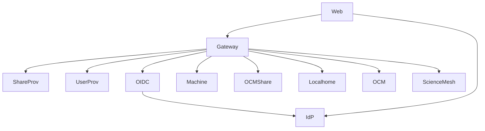

# CERNBox Services Reference

CERNBox-specific service deployment details and container configuration.

> **Generic Service Descriptions**: For detailed descriptions of Reva services (gateway, dataprovider, authprovider, share providers, user/group providers), see [Reva Base Services Documentation](../../revad-base/docs/services.md).

## Gateway Container

**Container Name:** `cernbox-1-test-revad-gateway`  
**Port:** 9142 (gRPC), 80 (HTTP)  
**Config File:** `gateway.toml` (provided by revad-base)

See [Reva Base Services - Gateway](../../revad-base/docs/services.md#gateway-service) for service descriptions.

## Share Providers Container

**Container Name:** `cernbox-1-test-revad-shareproviders`  
**Port:** 9144 (gRPC)  
**Config File:** `shareproviders.toml` (provided by revad-base)

See [Reva Base Services - Share Providers](../../revad-base/docs/services.md#share-providers-service) for service descriptions.

## User/Group Providers Container

**Container Name:** `cernbox-1-test-revad-groupuserproviders`  
**Port:** 9145 (gRPC)  
**Config File:** `groupuserproviders.toml` (provided by revad-base)

See [Reva Base Services - User/Group Providers](../../revad-base/docs/services.md#usergroup-providers-service) for service descriptions.

## Auth Provider Containers

### OIDC Auth Provider

**Container Name:** `cernbox-1-test-revad-authprovider-oidc`  
**Port:** 9158 (gRPC)  
**Config File:** `authprovider-oidc.toml` (provided by revad-base)

See [Reva Base Services - OIDC Auth Provider](../../revad-base/docs/services.md#oidc-auth-provider) for service description.

### Machine Auth Provider

**Container Name:** `cernbox-1-test-revad-authprovider-machine`  
**Port:** 9166 (gRPC)  
**Config File:** `authprovider-machine.toml` (provided by revad-base)

See [Reva Base Services - Machine Auth Provider](../../revad-base/docs/services.md#machine-auth-provider) for service description.

### OCM Shares Auth Provider

**Container Name:** `cernbox-1-test-revad-authprovider-ocmshares`  
**Port:** 9278 (gRPC)  
**Config File:** `authprovider-ocmshares.toml` (provided by revad-base)

See [Reva Base Services - OCM Shares Auth Provider](../../revad-base/docs/services.md#ocm-shares-auth-provider) for service description.

### Public Shares Auth Provider

**Container Name:** `cernbox-1-test-revad-authprovider-publicshares`  
**Port:** 9160 (gRPC)  
**Config File:** `authprovider-publicshares.toml` (provided by revad-base)

See [Reva Base Services - Public Shares Auth Provider](../../revad-base/docs/services.md#public-shares-auth-provider) for service description.

## Dataprovider Containers

### Localhome Dataprovider

**Container Name:** `cernbox-1-test-revad-dataprovider-localhome`  
**Port:** 9143 (gRPC), 80 (HTTP)  
**Config File:** `dataprovider-localhome.toml` (provided by revad-base)

See [Reva Base Services - Localhome Dataprovider](../../revad-base/docs/services.md#localhome-dataprovider) for service description.

### OCM Dataprovider

**Container Name:** `cernbox-1-test-revad-dataprovider-ocm`  
**Port:** 9146 (gRPC), 80 (HTTP)  
**Config File:** `dataprovider-ocm.toml` (provided by revad-base)

See [Reva Base Services - OCM Dataprovider](../../revad-base/docs/services.md#ocm-dataprovider) for service description.

### ScienceMesh Dataprovider

**Container Name:** `cernbox-1-test-revad-dataprovider-sciencemesh`  
**Port:** 9147 (gRPC), 80 (HTTP)  
**Config File:** `dataprovider-sciencemesh.toml` (provided by revad-base)

See [Reva Base Services - ScienceMesh Dataprovider](../../revad-base/docs/services.md#sciencemesh-dataprovider) for service description.

## External Services

### Keycloak IdP

**Container Name:** `cernbox-1-test-idp`  
**Port:** 8080 (HTTPS)  
**Purpose:** Identity Provider for OIDC authentication

**Features:**

- User authentication
- OAuth2/OIDC token issuance
- User management

### CERNBox Web Frontend

**Container Name:** `cernbox-1-test-web`  
**Port:** 80 (HTTP)  
**Purpose:** Web user interface

**Features:**

- Web-based file browser
- User interface
- Authentication UI

## Service Dependencies

## Service Communication

- **gRPC:** Used for all inter-service communication
- **HTTP:** Used for external access and data transfer
- **Internal DNS:** Container names resolve automatically via Docker networking

See [Reva Base Architecture](../../revad-base/docs/architecture.md) for details on service communication patterns.

## Related Documentation

- [Architecture](architecture.md) - System architecture overview
- [Port Assignments](ports.md) - Port reference
- [Configuration](configuration.md) - Configuration details
